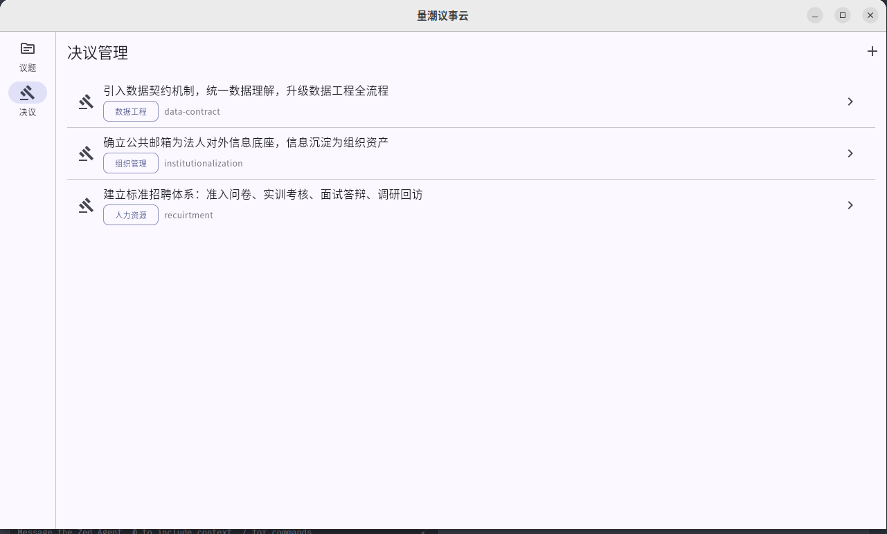
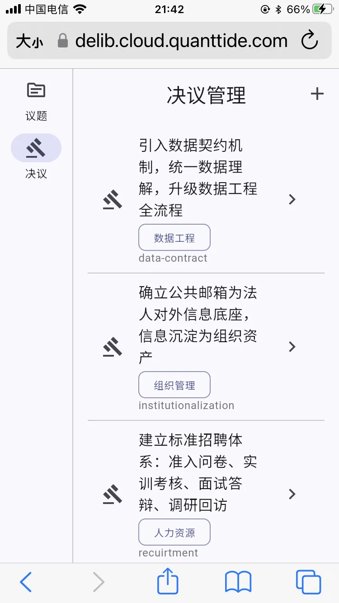
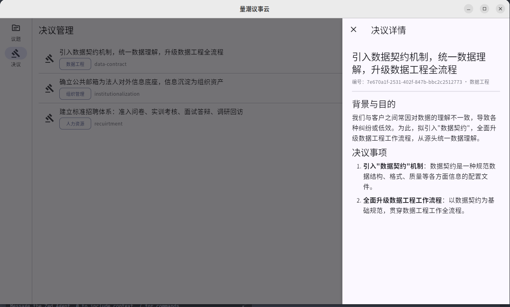

# 量潮议事云进入内测阶段

量潮议事云已经上线内测版本：https://delib.cloud.quanttide.com

仓库开源在 GitHub 组织 quanttide 的 qtcloud-delib 仓库。

---

目前上线的是展示公开决议的列表和详情页面，这套页面未来仍计划保留作为对外沟通工具。业务数据来源于昨天周会产生的决议，经过后台直接导入，前台只暴露了访问页面。

决议列表页面展示所有的决议清单：

手机端类似：

---

这里的最佳实践是在标题写清楚决议基本结论。为此还专门重新清洗了原始文本制作了专门的标题。

点击决议以后，可以在右侧展示决议正文。

在手机端上操作会进入一个新页面：

---

这个平台出发于我们需要管理海量的周会决议。由于每周周会都要通过 10-20 个决议，且往往在会下还有大量的决定要做，人脑已经无法记录那么多信息量了。

为了集中管理承载了团队集体智慧的决议，我们在议事云增加了决议管理工具。目前它的主要功能还是简单地管理议题文本和标注分类，进一步的功能还待未来开发。

我们正在逐渐把议事的全部生命周期逐渐向平台整合。议事过程目前还是使用云文档承载，未来会逐渐迁移到平台的议题管理功能中。

我们拟计划逐渐把平台推广到所有需要形成正式决议的场景，包括但是不限于量潮数据的客户、量潮课堂的学员和老师等等外部场景，作为一个标准化组件集成在自研平台的底座。

这个平台比较适合与会议软件搭配，因此我们未来也会积极适配。它的设计意图是打通议事过程的会前、会中和会后，以获得更完整的对于议题的生命周期管理。